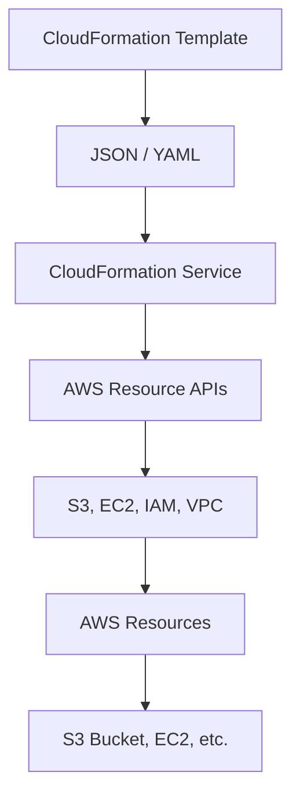

# AWS CloudFormation

## CloudFormation

AWS CloudFormation is an Infrastructure as Code (IaC) service that
allows you to define and provision AWS infrastructure using JSON or YAML
templates.

Instead of manually creating resources in AWS Console, you define
infrastructure in a template file and deploy it as a Stack.

------------------------------------------------------------------------

## Uses CloudFormation

-   Infrastructure as Code (IaC)
-   Automation
-   Version control
-   Repeatable deployments
-   Rollback on failure
-   Change tracking
-   Drift detection

------------------------------------------------------------------------

## How CloudFormation Works

### Step-by-Step Flow

1.  Write Template (JSON/YAML)
2.  Upload Template to CloudFormation
3.  Create Stack
4.  CloudFormation reads template
5.  Calls AWS service APIs
6.  Creates resources in correct order
7.  Stack creation completes

## Flow Diagram



## Template Structure

```json
## Template Structure

{
    "AWSTemplateFormatVersion": "2010-09-09",
    "Description": "TemplateDescription",
    "Parameters": {},
    "Resources": {},
    "Outputs": {}
}
```
------------------------------------------------------------------------

## Example: JSON Template to Create S3 Bucket


```json
{
    "AWSTemplateFormatVersion": "2010-09-09",
    "Description": "Create an S3
Bucket using CloudFormation", "Resources": { "MyS3Bucket": { "Type":"AWS::S3::Bucket",
    "Properties": {
        "BucketName": "my-demo-cloudformation-bucket-12345",
        "VersioningConfiguration": {
            "Status": "Enabled"
        }
    }
}
},
"Outputs": {
"BucketName": {
    "Description": "Name of the S3 bucket",
    "Value": {
        "Ref": "MyS3Bucket"
    }
}
}
}

```
------------------------------------------------------------------------

## Deployment Using AWS CLI

aws cloudformation create-stack\
--stack-name my-s3-stack\
--template-body file://s3-bucket.json

------------------------------------------------------------------------

## Important Exam Points

-   Declarative Infrastructure
-   Supports JSON & YAML
-   Automatic rollback
-   Change Sets
-   Drift Detection
-   Stack-based resource management

------------------------------------------------------------------------
