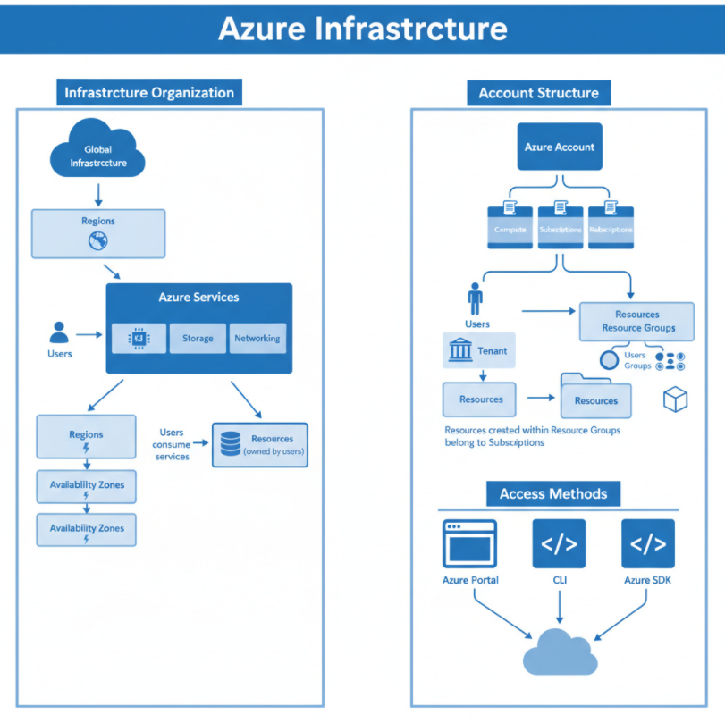

# Cloud Accounts Overview:

## 1. AWS – Accounts
- **Infrastructure Organization:**
  - Global infrastructure → **Regions** → **Availability Zones (AZs)**
- **Services:**
  - AWS offers a wide range of services to build and manage applications.
  - Users consume services to create resources, and **resource ownership remains with the user**.
- **Accounts:**
  - The account used to register with AWS becomes the **Root Account** (full permissions).
  - Root account can add/remove/manage other accounts using **IAM (Identity and Access Management)**.
- **Access Methods:**
  - **Browser:** AWS Management Console
  - **Command Line:** AWS CLI
  - **SDKs (Code):** AWS SDK, Boto3
 

  

---

## 2. Azure – Accounts
- **Infrastructure Organization:**
  - Global infrastructure → **Regions** → some regions further divided into **Zones**
- **Services:**
  - Azure offers services similar to AWS for application needs.
  - Users consume services to create resources, and **resource ownership remains with the user**.
- **Accounts:**
  - The account used to register with Azure is linked to **Subscriptions**.
  - Each subscription is tied to a **Tenant** (which contains users, groups, etc.).
  - Resources are created inside **Resource Groups**, which belong to a subscription.
- **Access Methods:**
  - **Browser:** Azure Portal
  - **Command Line:** Azure CLI
  - **SDKs (Code):** Azure SDK

  

---

## 3. Key Differences
| Feature              | AWS                               | Azure                                   |
|----------------------|-----------------------------------|-----------------------------------------|
| Root Account         | Yes, with full permissions        | Not a direct “root”; uses subscriptions tied to tenants |
| Resource Organization| Regions → Availability Zones      | Regions → Zones (some) → Resource Groups |
| Identity Management  | IAM (users, roles, policies)      | Azure AD (tenants, users, groups)       |
| Access Tools         | Console, CLI, SDK (Boto3)         | Portal, CLI, SDK                        |
