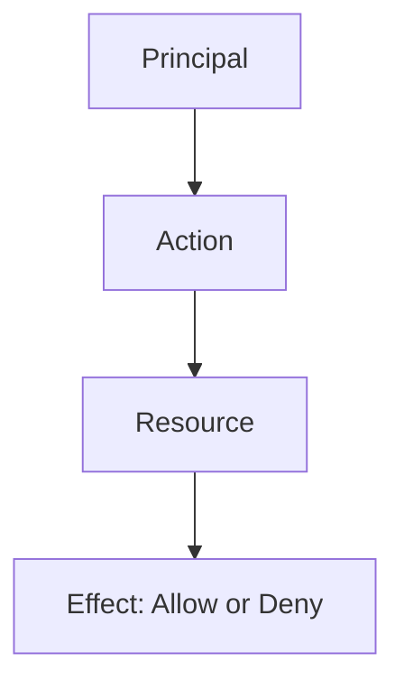

# AWS IAM Policy

## 1. Core Concepts

### Principal
The entity that requests access to AWS resources.
- IAM User
- IAM Role (AWS service or resource accessing another resource)
- External Identities (SAML, OIDC – e.g., Google, Facebook)
- Applications

### Resource
Any AWS service or object (EC2, S3 bucket, DynamoDB table, etc.).
- Identified by an **Amazon Resource Name (ARN)**

### Action
The specific operation performed on a resource.
- `s3:GetObject`
- `ec2:StartInstances`

### Effect
Defines whether access is allowed or denied.
- `Allow`
- `Deny`
- **Default**: Deny
- **Rule**: Explicit Deny overrides Allow

---

## 2. IAM Policy Grammar

IAM policies define **who** can perform **what actions** on **which resources**, with a specific **effect**.

### Policy Structure (JSON)

```json
{
  "Version": "2012-10-17",
  "Statement": [
    {
      "Effect": "Allow",
      "Principal": {
        "AWS": "arn:aws:iam::123456789012:user/Alice"
      },
      "Action": [
        "s3:GetObject",
        "s3:PutObject"
      ],
      "Resource": "arn:aws:s3:::example-bucket/*"
    }
  ]
}
```

## 3. Key Elements

### Version
Policy language version (`"2012-10-17"`)

### Statement
One or more permission blocks

### Effect
- `"Allow"`
- `"Deny"`

### Principal
Who the policy applies to (resource-based policies)

### Action
AWS service operations

### Resource
ARN or list of ARNs

### Condition (optional)
Fine-grained access control (IP, MFA, time, VPC, etc.)

---

## 4. JSON Basics

### Name–Value Pair
```json
"key": "value"

## Value Types
- String
- Number
- Boolean (`true` / `false`)
- List (array)
- Object (nested JSON)

---

## 5. Least Privilege Principle

Grant **only the permissions required** to perform a task.

### Examples
- ✅ Allow `s3:GetObject` on a specific bucket
- ❌ Allow `"Action": "*"` on `"Resource": "*"`

---

## 6. Example Policies

### Allow EC2 Start/Stop for a Specific Instance
```json
{
  "Version": "2012-10-17",
  "Statement": [
    {
      "Effect": "Allow",
      "Action": [
        "ec2:StartInstances",
        "ec2:StopInstances"
      ],
      "Resource": "arn:aws:ec2:us-east-1:123456789012:instance/i-0abcd1234efgh5678"
    }
  ]
}
```

## 7. Best Practices

- Enforce security using conditions (IP, MFA, time-based access)
- Apply least privilege aggressively
- Regularly audit policies
- Prefer AWS managed policies when appropriate

---

## 8. Permission Evaluation Flow


