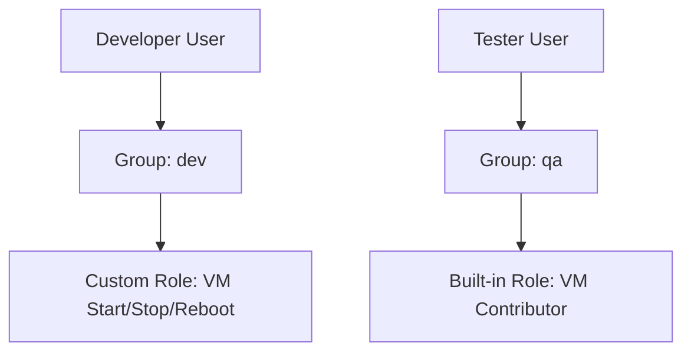

# Azure RBAC Setup for VM Access (Azure CLI)

how to create Azure AD users and groups, then assign RBAC roles for VM access using Azure CLI.

# Diagram: Users, Groups, and Roles

```ASCII
+-----------+        +---------+        +-----------------------------+
| Developer | -----> |   dev   | -----> | VM Start/Stop/Reboot (Custom)|
+-----------+        +---------+        +-----------------------------+

+---------+          +---------+        +-----------------------------+
| Tester  | ----->   |   qa    | -----> | Virtual Machine Contributor |
+---------+          +---------+        +-----------------------------+
```

## Purpose
- Create users: **Developer**, **Tester**  
- Create groups: **dev**, **qa**  
- RBAC:  
  - **qa** = Full VM access  
  - **dev** = Start, Stop, Reboot only  

## Prerequisites
- Azure subscription  
- Azure CLI installed  
- Logged in to Azure:  

```bash
  az login
```

## Global Variables
- Update values as needed before running:

```bash
SUBSCRIPTION_ID=$(az account show --query id -o tsv)
RESOURCE_GROUP="my-rg"
TENANT_DOMAIN="<your-tenant>.onmicrosoft.com"
```

## Step 1: Create Azure AD Users
```bash
# Developer User
az ad user create \
  --display-name "Developer" \
  --user-principal-name developer@$TENANT_DOMAIN \
  --mail-nickname "developer" \
  --password "P@ssw0rd!"

# Tester User
az ad user create \
  --display-name "Tester" \
  --user-principal-name tester@$TENANT_DOMAIN \
  --mail-nickname "tester" \
  --password "P@ssw0rd!"
```

## Step 2: Create Azure AD Groups
```bash
az ad group create --display-name "dev" --mail-nickname "dev"
az ad group create --display-name "qa"  --mail-nickname "qa"
```
## Step 3: Add Users to Groups

```bash
DEV_USER_ID=$(az ad user show --id developer@$TENANT_DOMAIN --query id -o tsv)
TEST_USER_ID=$(az ad user show --id tester@$TENANT_DOMAIN --query id -o tsv)

DEV_GROUP_ID=$(az ad group show --group dev --query id -o tsv)
QA_GROUP_ID=$(az ad group show --group qa --query id -o tsv)

az ad group member add --group $DEV_GROUP_ID --member-id $DEV_USER_ID
az ad group member add --group $QA_GROUP_ID --member-id $TEST_USER_ID
```
## Step 4: Assign RBAC Role to QA Group
```bash
az role assignment create \
  --assignee-object-id $QA_GROUP_ID \
  --assignee-principal-type Group \
  --role "Virtual Machine Contributor" \
  --scope /subscriptions/$SUBSCRIPTION_ID/resourceGroups/$RESOURCE_GROUP
```

## Step 5: Create Custom RBAC Role for DEV Group
```bash
cat > vm-dev-role.json << 'EOF'
{
  "Name": "VM Start Stop Reboot (Dev)",
  "IsCustom": true,
  "Description": "Start, stop (deallocate), restart VMs; read VM metadata",
  "Actions": [
    "Microsoft.Compute/virtualMachines/start/action",
    "Microsoft.Compute/virtualMachines/deallocate/action",
    "Microsoft.Compute/virtualMachines/restart/action",
    "Microsoft.Compute/virtualMachines/read",
    "Microsoft.Resources/subscriptions/resourceGroups/read"
  ],
  "NotActions": [],
  "AssignableScopes": [
    "/subscriptions/SUBSCRIPTION_ID_PLACEHOLDER"
  ]
}
EOF

sed -i "s/SUBSCRIPTION_ID_PLACEHOLDER/$SUBSCRIPTION_ID/" vm-dev-role.json

az role definition create --role-definition vm-dev-role.json
```
## Step 6: Assign Custom Role to DEV Group
```bash
az role assignment create \
  --assignee-object-id $DEV_GROUP_ID \
  --assignee-principal-type Group \
  --role "VM Start Stop Reboot (Dev)" \
  --scope /subscriptions/$SUBSCRIPTION_ID/resourceGroups/$RESOURCE_GROUP
```

## policy for qa

```json
{
  "Name": "Custom-VM-Full-Access",
  "IsCustom": true,
  "Description": "Allows full management of Virtual Machines and related resources.",
  "Actions": [
    "Microsoft.Compute/virtualMachines/*",
    "Microsoft.Compute/disks/*",
    "Microsoft.Compute/snapshots/*",
    "Microsoft.Compute/images/*",
    "Microsoft.Compute/availabilitySets/*",
    "Microsoft.Network/networkInterfaces/*",
    "Microsoft.Network/publicIPAddresses/*",
    "Microsoft.Network/networkSecurityGroups/join/action",
    "Microsoft.Network/virtualNetworks/subnets/join/action",
    "Microsoft.Resources/subscriptions/resourceGroups/read",
    "Microsoft.Resources/deployments/*"
  ],
  "NotActions": [],
  "AssignableScopes": [
    "/subscriptions/<SUBSCRIPTION_ID>"
  ]
}

```
