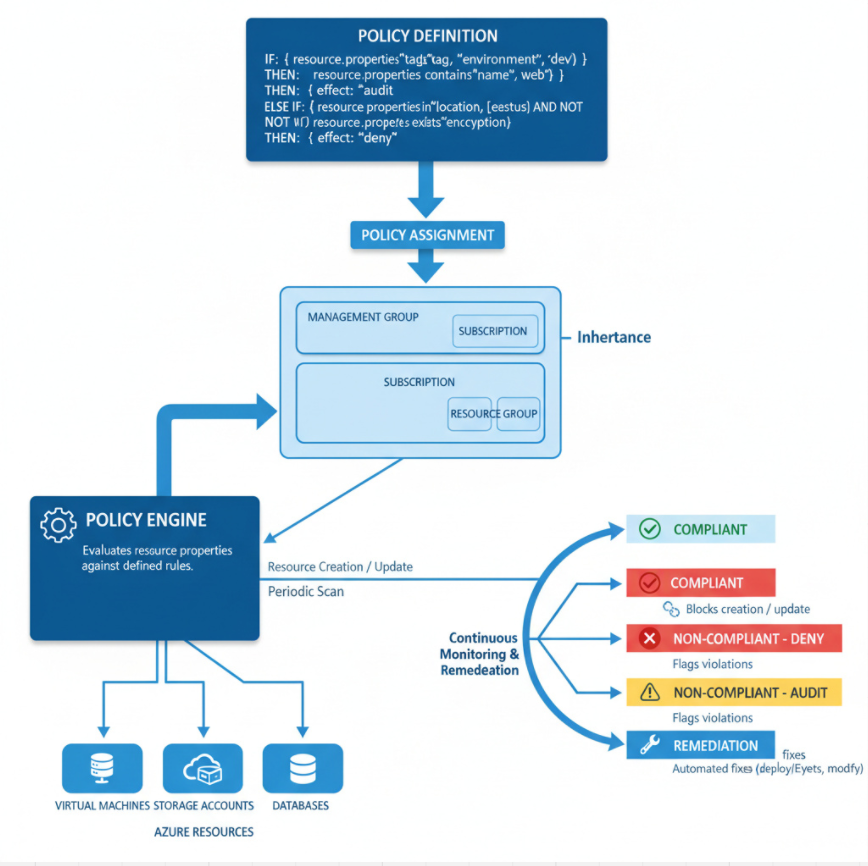

# Azure Policy Guide

## Overview
* Azure Policy is a governance service that defines and enforces rules across Azure resources to ensure compliance and consistency. 
* It evaluates resources at creation and periodically, applying effects such as **deny** or **audit** to keep environments aligned with standards.

## Azure Policy
- **Policy Definitions**: Describe desired states for resources.  
- **Assignments**: Apply policies to scopes (management groups, subscriptions, resource groups).  
- **Initiatives**: Bundles of multiple policies for broader compliance goals.



## Use Cases and Benefits
- **Compliance**: Enforce regulatory controls (e.g., encryption, location restrictions).  
- **Security**: Require secure configurations (e.g., HTTPS only, NSG rules).  
- **Cost Management**: Enforce tags and sizes, prevent expensive SKUs.  
- **Standardization**: Ensure naming, tags, and configurations are consistent.  

## Create Azure Policy Azure CLI
```bash
# Create
az policy definition create --name <name> --rules <rules> --params <params> --display-name <display-name> --mode Indexed

# Assign
az policy assignment create --name <name> --policy <policy> --scope <scope> --params <params>

```
# How to Write Azure Policy

## Structure
- **DisplayName, Description, Mode** (Indexed for most resource types).  
- **Parameters**: Inputs to reuse and customize policies.  
- **PolicyRule**: `if (condition) then (effect)`.  

## Rule Syntax
- **If**: Match conditions on resource properties using logical operators (`equals`, `contains`, `in`, `not`).  
- **Then**: Apply an effect.  

## Effects
- **deny**: Blocks non-compliant creation/updates.  
- **audit**: Flags non-compliance.  
- **append**: Adds missing fields (e.g., tags).  
- **modify**: Alters request to enforce values.  
- **deployIfNotExists**: Runs remediation deployment when missing.  
- **auditIfNotExists**: Flags when dependent resource is absent.  

## Parameters
- Define `name`, `type`, `defaultValue`, `allowedValues`.  
- Reference in rules with `[parameters('name')]`.  

## Aliases
- Use policy aliases to reference resource properties (e.g., `Microsoft.Compute/virtualMachines/storageProfile.osDisk.managedDisk.id`).  
- Find aliases in **Portal > Policy > Definitions > Aliases** or documentation.  

## Best Practices
- Start with **audit** before **deny**.  
- Use **initiatives** for related controls.  
- Parameterize for reuse.  
- Scope narrowly, then expand.  
- Enable remediation tasks for **modify** and **deployIfNotExists**.  
- Document intent and owners.  

## Common Examples
- **Enforce tags**: Append or modify to require `CostCenter` tag with allowed values.  
- **Restrict locations**: Deny if location not in allowed list.  
- **Require configurations**:  
  - Enforce HTTPS only on App Services.  
  - Require NSG on subnets.  
  - Enforce disk encryption on VMs.  

```json
{
  "policies": [
    {
      "name": "Enforce-CostCenter-Tag",
      "properties": {
        "displayName": "Require CostCenter Tag",
        "description": "Ensures all resources have a CostCenter tag with allowed values.",
        "mode": "Indexed",
        "parameters": {
          "tagName": {
            "type": "String",
            "defaultValue": "CostCenter"
          },
          "allowedValues": {
            "type": "Array",
            "allowedValues": ["Finance", "HR", "IT", "Marketing"]
          }
        },
        "policyRule": {
          "if": {
            "field": "[concat('tags[', parameters('tagName'), ']')]",
            "notIn": "[parameters('allowedValues')]"
          },
          "then": {
            "effect": "modify",
            "details": {
              "roleDefinitionIds": [
                "/providers/Microsoft.Authorization/roleDefinitions/..."
              ],
              "operations": [
                {
                  "operation": "addOrReplace",
                  "field": "[concat('tags[', parameters('tagName'), ']')]",
                  "value": "[parameters('allowedValues')[0]]"
                }
              ]
            }
          }
        }
      }
    },
    {
      "name": "Restrict-Locations",
      "properties": {
        "displayName": "Restrict Resource Locations",
        "description": "Allows resources only in approved regions.",
        "mode": "Indexed",
        "parameters": {
          "allowedLocations": {
            "type": "Array",
            "allowedValues": ["eastus", "westus", "centralus"]
          }
        },
        "policyRule": {
          "if": {
            "field": "location",
            "notIn": "[parameters('allowedLocations')]"
          },
          "then": {
            "effect": "deny"
          }
        }
      }
    },
    {
      "name": "Require-HTTPS-AppService",
      "properties": {
        "displayName": "Enforce HTTPS on App Services",
        "description": "Requires HTTPS-only configuration for App Services.",
        "mode": "Indexed",
        "policyRule": {
          "if": {
            "allOf": [
              {
                "field": "type",
                "equals": "Microsoft.Web/sites"
              },
              {
                "field": "Microsoft.Web/sites/httpsOnly",
                "equals": "false"
              }
            ]
          },
          "then": {
            "effect": "deny"
          }
        }
      }
    },
    {
      "name": "Require-NSG-Subnets",
      "properties": {
        "displayName": "Require NSG on Subnets",
        "description": "Ensures all subnets are associated with a Network Security Group.",
        "mode": "Indexed",
        "policyRule": {
          "if": {
            "field": "type",
            "equals": "Microsoft.Network/virtualNetworks/subnets"
          },
          "then": {
            "effect": "auditIfNotExists",
            "details": {
              "type": "Microsoft.Network/networkSecurityGroups",
              "existenceCondition": {
                "field": "Microsoft.Network/networkSecurityGroups/subnets[*].id",
                "equals": "[field('id')]"
              }
            }
          }
        }
      }
    },
    {
      "name": "Require-Disk-Encryption",
      "properties": {
        "displayName": "Require Disk Encryption on VMs",
        "description": "Ensures all virtual machines use encrypted disks.",
        "mode": "Indexed",
        "policyRule": {
          "if": {
            "allOf": [
              {
                "field": "type",
                "equals": "Microsoft.Compute/virtualMachines"
              },
              {
                "field": "Microsoft.Compute/virtualMachines/storageProfile.osDisk.encryptionSettings.enabled",
                "equals": "false"
              }
            ]
          },
          "then": {
            "effect": "deny"
          }
        }
      }
    }
  ]
}

```

### This JSON includes sample Azure Policy definitions for the common examples:

* Enforcing tags (```CostCenter```)

* Restricting resource locations

* Requiring HTTPS on App Services

* Requiring NSG on subnets

* Enforcing disk encryption on VMs
