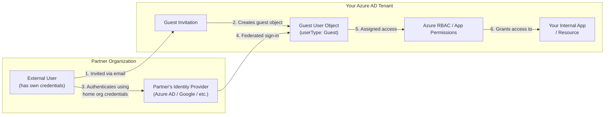
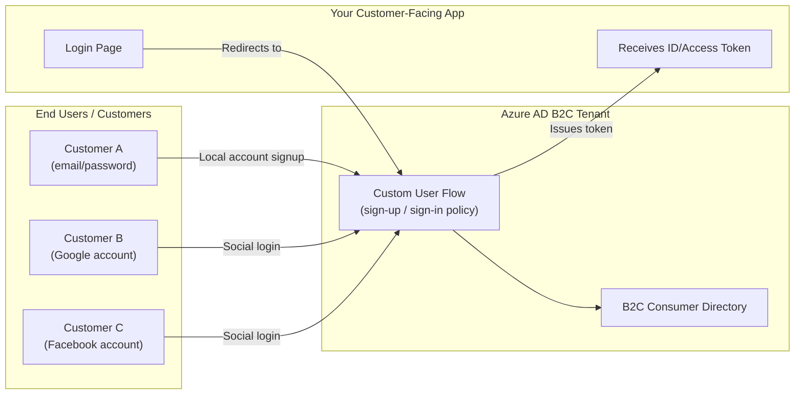

# Azure AD B2B (Business-to-Business)

**Purpose:** Let external partners, vendors, or contractors access your internal apps/resources using **their own existing identity** (their own company's Azure AD, Google account, etc.).

**Key idea:** The external user is invited as a **guest** into *your* tenant. They authenticate with their home organization, but authorization (what they can access) is governed by your tenant.

**Characteristics:**
- One tenant inviting users who belong to *another* organization.
- Guest users authenticate at their **home IdP** — you never manage their password.
- Access is controlled via normal Azure RBAC / Conditional Access in your tenant.
- Typical use case: giving a contractor access to a SharePoint site, a partner engineer access to an internal DevOps project, etc.

---

# Azure AD B2C (Business-to-Consumer)

**Purpose:** Let **customers/consumers** (the public) sign up and sign in to a **customer-facing application** you build — using local accounts (email/password) or social identity providers (Google, Facebook, etc.).

**Key idea:** B2C is a **separate, dedicated tenant type** used purely as an identity platform for your app's end users. It is not about accessing your internal Azure resources.

**Characteristics:**
- Millions of consumer identities, not a handful of partner staff.
- Fully customizable sign-up/sign-in UI (branding, custom policies via Identity Experience Framework).
- Supports local accounts + social IdPs (Google, Facebook, Apple, etc.) + custom OIDC/SAML IdPs.
- Lives in its own dedicated B2C tenant, separate from your corporate Entra ID tenant.
- Typical use case: a retail app's customer login, a SaaS product's public sign-up flow.

# One-Line Summary

- **B2B** = "Let *another company's* employee into *my* tenant as a guest."
- **B2C** = "Let *the general public* sign up and log into *my app*."
